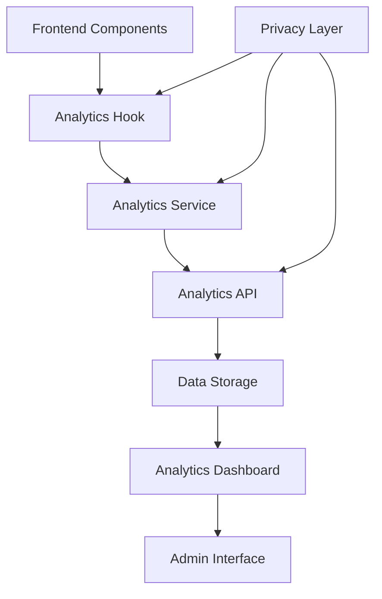

# Design Document

## Overview

The Self Analytics Integration feature will implement a comprehensive, privacy-first analytics system for the Rant platform. The system will track user engagement, content performance, and platform usage patterns while maintaining strict privacy standards. The design follows a modular architecture with clear separation between data collection, storage, processing, and visualization layers.

## Architecture

### High-Level Architecture



### Data Flow

1. **Event Generation**: User interactions trigger analytics events in React components
2. **Privacy Filtering**: Events are filtered through privacy checks (DNT, user preferences)
3. **Event Processing**: Analytics service processes and enriches event data
4. **API Transmission**: Events are sent to the backend API endpoint
5. **Data Storage**: Events are stored in a structured database schema
6. **Dashboard Queries**: Admin dashboard queries aggregated analytics data
7. **Visualization**: Data is presented through charts and tables

## Components and Interfaces

### Frontend Components

#### Analytics Hook (`useAnalytics`)
```typescript
interface AnalyticsHook {
  trackEvent: (type: string, details?: Record<string, any>) => Promise<void>
  trackPageView: (page: string) => Promise<void>
  trackUserAction: (action: string, context?: Record<string, any>) => Promise<void>
  isEnabled: () => boolean
  setEnabled: (enabled: boolean) => void
}
```

#### Analytics Service (`lib/self-analytics.ts`)
```typescript
interface AnalyticsService {
  trackEvent: (type: string, details?: Record<string, any>) => Promise<void>
  batchEvents: (events: AnalyticsEvent[]) => Promise<void>
  getSessionId: () => string
  respectsPrivacy: () => boolean
}
```

#### Analytics Dashboard Component
```typescript
interface AnalyticsDashboard {
  dateRange: DateRange
  metrics: AnalyticsMetrics
  charts: ChartData[]
  filters: AnalyticsFilters
}
```

### Backend Components

#### Analytics API Route (`app/api/analytics/route.ts`)
```typescript
interface AnalyticsAPI {
  POST: (request: Request) => Promise<Response>
  GET: (request: Request) => Promise<Response> // For dashboard queries
}
```

#### Database Schema
```sql
-- Analytics Events Table
CREATE TABLE analytics_events (
  id SERIAL PRIMARY KEY,
  type VARCHAR(50) NOT NULL,
  page VARCHAR(255),
  timestamp BIGINT NOT NULL,
  session_id VARCHAR(36),
  user_id VARCHAR(36),
  details JSONB,
  user_agent TEXT,
  referrer TEXT,
  created_at TIMESTAMP DEFAULT NOW()
);

-- Analytics Sessions Table
CREATE TABLE analytics_sessions (
  id VARCHAR(36) PRIMARY KEY,
  user_id VARCHAR(36),
  first_seen TIMESTAMP DEFAULT NOW(),
  last_seen TIMESTAMP DEFAULT NOW(),
  page_views INTEGER DEFAULT 0,
  events_count INTEGER DEFAULT 0,
  is_active BOOLEAN DEFAULT TRUE
);

-- Analytics Users Table
CREATE TABLE analytics_users (
  id VARCHAR(36) PRIMARY KEY,
  first_seen TIMESTAMP DEFAULT NOW(),
  last_seen TIMESTAMP DEFAULT NOW(),
  total_sessions INTEGER DEFAULT 0,
  total_page_views INTEGER DEFAULT 0,
  total_events INTEGER DEFAULT 0,
  created_at TIMESTAMP DEFAULT NOW()
);
```

## Data Models

### Analytics Event Model
```typescript
interface AnalyticsEvent {
  id?: string
  type: string
  page: string
  timestamp: number
  sessionId: string
  details: Record<string, any>
  userAgent?: string
  referrer?: string
  dnt: boolean
}
```

### Analytics Metrics Model
```typescript
interface AnalyticsMetrics {
  totalPageViews: number
  uniqueSessions: number
  totalUsers: number
  onlineUsers: number
  topPages: PageMetric[]
  userActions: ActionMetric[]
  contentPerformance: ContentMetric[]
  timeRangeData: TimeSeriesData[]
}

interface UserMetrics {
  totalUsers: number
  onlineUsers: number
  newUsersToday: number
  activeUsersLast7Days: number
  userGrowthData: TimeSeriesData[]
}
```

### Dashboard Configuration Model
```typescript
interface DashboardConfig {
  refreshInterval: number
  defaultDateRange: DateRange
  enabledCharts: ChartType[]
  privacyMode: boolean
}
```

## Error Handling

### Client-Side Error Handling
- **Silent Failures**: Analytics failures should never impact user experience
- **Retry Logic**: Implement exponential backoff for failed requests
- **Offline Support**: Queue events when offline, send when connection restored
- **Privacy Errors**: Gracefully handle DNT and privacy preference changes

### Server-Side Error Handling
- **Validation Errors**: Validate all incoming analytics data
- **Database Errors**: Handle connection failures and constraint violations
- **Rate Limiting**: Implement rate limiting to prevent abuse
- **Data Integrity**: Ensure data consistency and prevent corruption

### Error Logging Strategy
```typescript
interface ErrorHandling {
  logLevel: 'error' | 'warn' | 'info'
  silentMode: boolean
  retryAttempts: number
  fallbackStorage: 'localStorage' | 'none'
}
```

## Testing Strategy

### Unit Testing
- **Analytics Hook**: Test event tracking, privacy checks, and state management
- **Analytics Service**: Test event processing, batching, and API communication
- **API Routes**: Test request handling, validation, and database operations
- **Dashboard Components**: Test data visualization and user interactions

### Integration Testing
- **End-to-End Event Flow**: Test complete event lifecycle from trigger to storage
- **Privacy Compliance**: Test DNT handling and user preference respect
- **Dashboard Data Flow**: Test data retrieval and visualization pipeline
- **Error Scenarios**: Test system behavior under various failure conditions

### Performance Testing
- **Event Throughput**: Test system performance under high event volumes
- **Dashboard Loading**: Test dashboard performance with large datasets
- **Database Queries**: Test query performance and optimization
- **Memory Usage**: Test for memory leaks in long-running sessions

### Privacy Testing
- **DNT Compliance**: Verify Do Not Track header respect
- **Data Anonymization**: Ensure no PII is collected or stored
- **User Preferences**: Test privacy setting enforcement
- **Data Retention**: Test automatic data cleanup and retention policies

## Implementation Phases

### Phase 1: Core Infrastructure
1. Enhance existing analytics service with privacy features
2. Create analytics hook for React components
3. Implement database schema and migrations
4. Set up basic API endpoints for event collection

### Phase 2: Event Tracking Integration
1. Integrate analytics tracking into existing components
2. Implement pageview tracking with Next.js router
3. Add user action tracking (likes, posts, bookmarks)
4. Create content performance tracking

### Phase 3: Dashboard Development
1. Create admin dashboard layout and navigation
2. Implement basic metrics display (pageviews, sessions)
3. Add data visualization with charts and graphs
4. Create filtering and date range selection

### Phase 4: Advanced Features
1. Implement real-time analytics updates
2. Add advanced content performance metrics
3. Create custom event tracking for new features
4. Implement data export functionality

### Phase 5: Optimization and Monitoring
1. Optimize database queries and indexing
2. Implement caching for dashboard performance
3. Add monitoring and alerting for system health
4. Create automated testing and deployment pipeline

## Security Considerations

### Data Protection
- **No PII Collection**: Strictly avoid collecting personally identifiable information
- **Session Anonymization**: Use temporary, non-persistent session identifiers
- **Data Encryption**: Encrypt sensitive analytics data at rest and in transit
- **Access Control**: Implement role-based access for analytics dashboard

### Privacy Compliance
- **GDPR Compliance**: Ensure compliance with European privacy regulations
- **CCPA Compliance**: Respect California Consumer Privacy Act requirements
- **DNT Respect**: Honor Do Not Track browser settings
- **User Consent**: Implement clear consent mechanisms for analytics

### System Security
- **API Rate Limiting**: Prevent abuse of analytics endpoints
- **Input Validation**: Sanitize all incoming analytics data
- **SQL Injection Prevention**: Use parameterized queries for database operations
- **CSRF Protection**: Implement CSRF tokens for admin dashboard

## Performance Optimization

### Client-Side Optimization
- **Event Batching**: Batch multiple events to reduce API calls
- **Lazy Loading**: Load analytics components only when needed
- **Memory Management**: Prevent memory leaks in long-running sessions
- **Offline Queuing**: Queue events when offline for later transmission

### Server-Side Optimization
- **Database Indexing**: Optimize database queries with proper indexing
- **Caching Strategy**: Implement Redis caching for frequently accessed data
- **Query Optimization**: Use efficient SQL queries for dashboard data
- **Background Processing**: Process analytics data asynchronously

### Dashboard Optimization
- **Data Aggregation**: Pre-aggregate common metrics for faster loading
- **Pagination**: Implement pagination for large datasets
- **Chart Optimization**: Use efficient charting libraries and data structures
- **Real-time Updates**: Implement WebSocket connections for live data
